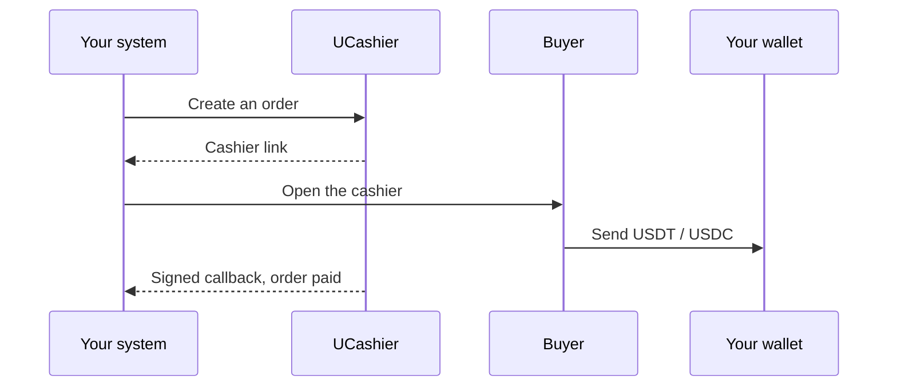
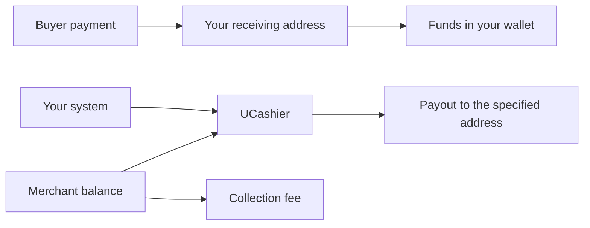

  

<h1 align="center">UCashier</h1>

<strong>Add stablecoin collection and payout to the business you already run.</strong>

  <a href="./README.md">简体中文</a> ·
  <a href="./README.zh-TW.md">繁體中文</a> ·
  <strong>English</strong>

  <a href="https://www.ucashier.ink/">Website</a> ·
  <a href="https://www.ucashier.ink/docs/index.html">Docs</a> ·
  <a href="https://dashboard.ucashier.ink/#/user/login">Open an account</a> ·
  <a href="https://t.me/UC_INK">Telegram</a>

UCashier is stablecoin payment infrastructure for businesses operating across markets. It connects on-chain collection, a hosted cashier, order confirmation, and merchant payouts, so an existing website, app, or back office can add stablecoin payments without being rebuilt.

Buyers pay in USDT or USDC, and the funds go directly to the wallet you bind. When you need to pay users, agents, or suppliers, payouts leave from the same merchant account. UCashier handles chain monitoring, order matching, and status notifications, so your team can stay focused on the product, customers, and growth.

| Self-custodial receiving address | USDT / USDC | TRC / ERC | $0 |
| --- | --- | --- | --- |
| Funds land in your wallet | Major stablecoins | Major networks | No setup, monthly, or annual fee |

## Make stablecoin payments an ordinary business capability

For most teams, the hard part is not generating a wallet address. It is turning an on-chain transfer into an order status that is trustworthy, traceable, and able to drive fulfillment.

UCashier sits between your business system and the blockchain. On one side are your orders, members, products, and settlement flows. On the other are payment confirmations across assets and networks. Your system creates an order, opens the cashier, receives a notification, and sends a payout. The buyer sees the asset, network, amount, address, and payment progress.

You do not need to invent a new payment system just to accept stablecoins.

## How one collection completes

USDT is available on TRC and ERC. USDC is available on ERC. UCashier hosts the cashier, amount, and countdown. You verify the signature, then fulfill the order.

## A clear path for the money

Collections arrive at the address you bind. Collection fees and payouts use the prepaid merchant balance. A payout goes only to the address you submit.

## Why teams choose UCashier

### Funds go to an address you control

The buyer's on-chain payment arrives at the receiving address you configured. It does not first settle into a platform pool. UCashier tracks the business order, while the on-chain asset stays with you.

### From collection to settlement

Accepting payment is only the start. The same merchant account covers payouts such as user withdrawals, agent commissions, and supplier settlement, so stablecoins can run through the business.

### Built for real orders

Matching amounts, concurrent payments, timeouts, and asynchronous confirmation are normal in live businesses. UCashier keeps each incoming transfer tied to its business order, so support and operations work from the order instead of a block-explorer screenshot.

### Verify, then act

Open APIs and asynchronous notifications are signed. Verify the signature before updating an order or fulfilling it. The query API gives you another way to check status.

### A clear path from test to production

The docs cover a first test collection, signing, webhooks, sandbox testing, and a production checklist. Prove the flow, then bring it into live business.

## For teams expanding across markets

UCashier fits teams that already have a product and an order system and want to add stablecoin collection and payout:

- Games, gift cards, digital content, and memberships
- Global SaaS, cloud hosting, and network services
- Agents, channels, and distribution settlement
- Advertising, traffic, and the creator economy
- Cross-border logistics, supply chains, and trade in services
- Web3 applications, developer tools, and infrastructure

The products and fulfillment models differ. The question is the same: how to bring the stablecoins global users already hold into your own orders and settlement.

## Less upfront cost, faster proof

There is no account-opening, integration, monthly, or annual fee. A collection fee is charged only after an order succeeds, from 0.5% of the amount. Payout fees follow what the merchant dashboard shows.

Register a test account, complete a first collection, and check the callback against your own flow before you expand. You do not need to build chain infrastructure first, or rebuild the product you already have.

## Get started

| | |
| --- | --- |
| Open an account | https://dashboard.ucashier.ink/#/user/login |
| Docs | https://www.ucashier.ink/docs/index.html |
| Website | https://www.ucashier.ink/ |
| Telegram | https://t.me/UC_INK |
| Email | support@ucashier.ink |
