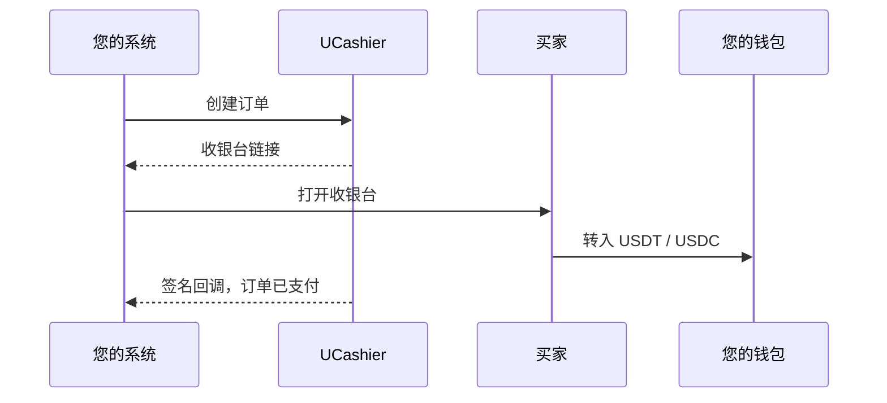
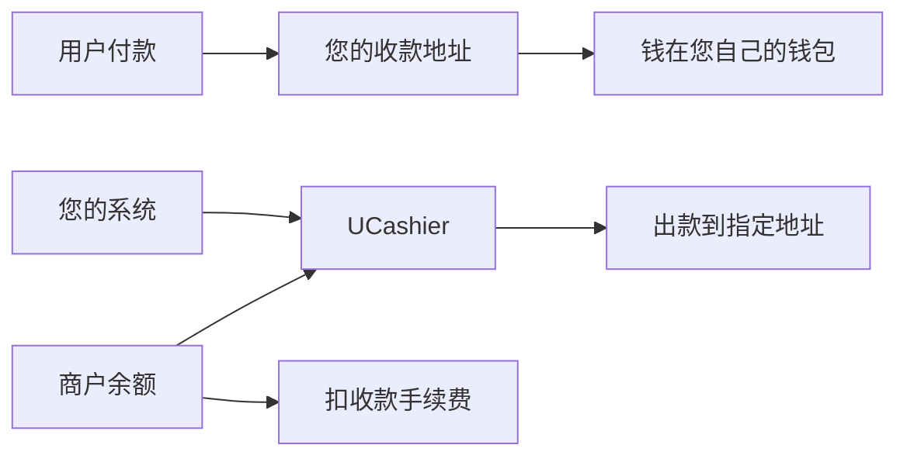

<h1 align="center">UCashier</h1>

<strong>稳定币收付，接到您已经在跑的业务上。</strong>

  <strong>简体中文</strong> ·
  <a href="./README.zh-TW.md">繁體中文</a> ·
  <a href="./README.en.md">English</a>

  <a href="https://www.ucashier.ink/">官网</a> ·
  <a href="https://www.ucashier.ink/docs/index.html">接入文档</a> ·
  <a href="https://dashboard.ucashier.ink/#/user/login">免费开通</a> ·
  <a href="https://beta.ucashier.ink/#/user/register">测试后台</a> ·
  <a href="https://t.me/UC_INK">Telegram</a>

UCashier 是面向全球业务的稳定币收付基础设施。它把链上收款、托管收银台、订单确认和商户出款连成一条完整链路，让已有站点、App 和业务后台不必推倒重来，也能快速增加稳定币这一种支付与结算方式。

买家支付 USDT / USDC，资金直接进入您绑定的钱包。需要向用户、代理或供应商付款时，再从同一个商户账户发起出款。复杂的链上监听、订单匹配和状态通知交给 UCashier，您继续专注于自己的产品、客户和增长。

| 自托管收款地址 | USDT / USDC | TRC / ERC | $0 |
| --- | --- | --- | --- |
| 资金直达您的钱包 | 主流稳定币 | 覆盖主流网络 | 开户 / 月费 / 年费 |

## 把稳定币变成一项普通的业务能力

对大多数团队来说，难点从来不是生成一个钱包地址，而是把链上交易变成可信、可追踪、能驱动业务履约的订单状态。

UCashier 站在业务系统与区块链之间：向前连接您的订单、会员、商品和结算流程，向后处理不同资产与网络的支付确认。您的系统看到的是创建订单、打开收银台、收到通知和发起出款；用户看到的是清晰的资产、网络、金额、地址和支付进度。

这意味着您不需要为了接受稳定币，重新发明一套支付系统。

## 一笔收款怎么走完

USDT 支持 TRC 与 ERC，USDC 支持 ERC。收银台、金额、倒计时都由 UCashier 托管。您验签之后履约。

## 资金路径简单而清楚

收款进您绑定的地址。手续费和出款走预充的商户余额。出款只打到您传入的地址。

## 为什么选择 UCashier

### 资金直接进入您控制的地址

用户的链上付款进入您预先绑定的收款地址，不需要先沉淀在平台资金池。业务订单由 UCashier 跟踪，链上资产仍由您掌握。

### 从收款延伸到完整结算

不只接受付款。同一个商户账户还能覆盖用户提现、代理分成、供应商结算等出款场景，让稳定币真正进入业务闭环。

### 为真实订单而设计

相同金额、并发支付、订单超时、异步确认，都是线上业务会遇到的问题。UCashier 把链上转入与业务订单持续关联，让客服和运营围绕订单处理，而不是依赖区块浏览器截图。

### 可验证，而不是盲目信任

开放接口与异步通知使用签名机制。商户先验签，再更新订单和履约；查询接口则为通知之外提供状态核对能力。

### 从测试到上线都有清晰路径

开发文档覆盖第一笔测试收款、签名、Webhook、沙箱联调和生产检查。团队可以先验证流程，再逐步接入真实业务。

## 适合正在全球化的团队

UCashier 适合已经拥有产品和订单系统，希望拓展稳定币收付能力的团队：

- 游戏、点卡、数字内容与会员服务
- 出海 SaaS、云主机与网络服务
- 代理、渠道与分销结算
- 广告、流量与创作者经济
- 跨境物流、供应链和服务贸易
- Web3 应用、开发者工具与基础服务

这些行业拥有不同的商品和履约方式，但面对的是同一个问题：如何把全球用户使用的稳定币，可靠地接入自己的订单和结算体系。

## 更少的前置成本，更快的验证

开户、接入、月费和年费均为 $0。收款手续费只在订单成功后按成交额计费，低至 0.5%；出款费用以商户后台展示为准。

您可以先注册测试账户，完成第一笔收款，验证回调和业务流程，再决定如何扩展。无需先投入一套链上基础设施，也无需先重构现有产品。

## 开始接入

| 入口 | 地址 |
| --- | --- |
| 免费开通 | https://dashboard.ucashier.ink/#/user/login |
| 测试后台 | https://beta.ucashier.ink/#/user/register |
| 开发文档 | https://www.ucashier.ink/docs/index.html |
| 官方网站 | https://www.ucashier.ink/ |
| Telegram | https://t.me/UC_INK |
| Email | support@ucashier.ink |
