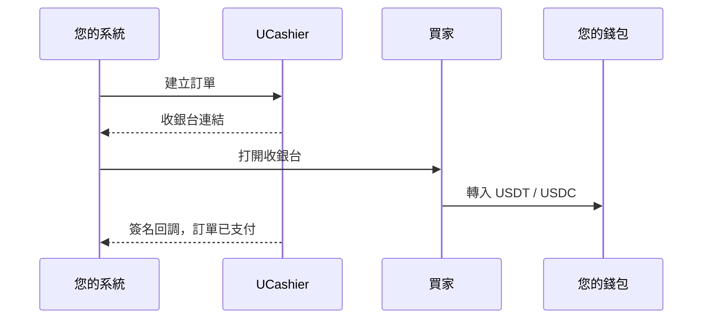
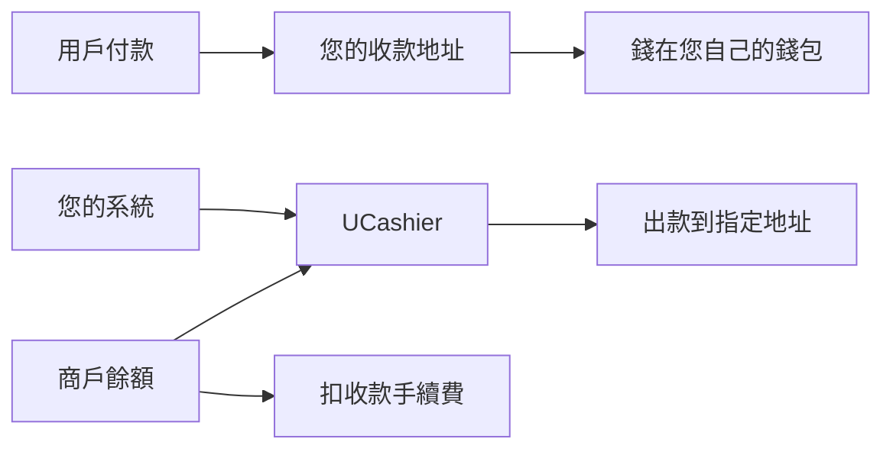

  

<h1 align="center">UCashier</h1>

<strong>穩定幣收付，接到您已經在跑的業務上。</strong>

  <a href="./README.md">简体中文</a> ·
  <strong>繁體中文</strong> ·
  <a href="./README.en.md">English</a>

  <a href="https://www.ucashier.ink/">官網</a> ·
  <a href="https://www.ucashier.ink/docs/index.html">接入文檔</a> ·
  <a href="https://dashboard.ucashier.ink/#/user/login">免費開通</a> ·
  <a href="https://t.me/UC_INK">Telegram</a>

UCashier 是面向全球業務的穩定幣收付基礎設施。它把鏈上收款、託管收銀台、訂單確認和商戶出款連成一條完整鏈路，讓已有站點、App 和業務後台不必推倒重來，也能快速增加穩定幣這一種支付與結算方式。

買家支付 USDT / USDC，資金直接進入您綁定的錢包。需要向用戶、代理或供應商付款時，再從同一個商戶帳戶發起出款。複雜的鏈上監聽、訂單匹配和狀態通知交給 UCashier，您繼續專注於自己的產品、客戶和增長。

| 自託管收款地址 | USDT / USDC | TRC / ERC | $0 |
| --- | --- | --- | --- |
| 資金直達您的錢包 | 主流穩定幣 | 覆蓋主流網路 | 開戶 / 月費 / 年費 |

## 把穩定幣變成一項普通的業務能力

對大多數團隊來說，難點從來不是生成一個錢包地址，而是把鏈上交易變成可信、可追蹤、能驅動業務履約的訂單狀態。

UCashier 站在業務系統與區塊鏈之間：向前連接您的訂單、會員、商品和結算流程，向後處理不同資產與網路的支付確認。您的系統看到的是建立訂單、打開收銀台、收到通知和發起出款；用戶看到的是清晰的資產、網路、金額、地址和支付進度。

這意味著您不需要為了接受穩定幣，重新發明一套支付系統。

## 一筆收款怎麼走完

USDT 支援 TRC 與 ERC，USDC 支援 ERC。收銀台、金額、倒數計時都由 UCashier 託管。您驗簽之後履約。

## 資金路徑簡單而清楚

收款進您綁定的地址。手續費和出款走預充的商戶餘額。出款只打到您傳入的地址。

## 為什麼選擇 UCashier

### 資金直接進入您控制的地址

用戶的鏈上付款進入您預先綁定的收款地址，不需要先沉澱在平台資金池。業務訂單由 UCashier 跟蹤，鏈上資產仍由您掌握。

### 從收款延伸到完整結算

不只接受付款。同一個商戶帳戶還能覆蓋用戶提現、代理分成、供應商結算等出款場景，讓穩定幣真正進入業務閉環。

### 為真實訂單而設計

相同金額、並發支付、訂單超時、非同步確認，都是線上業務會遇到的問題。UCashier 把鏈上轉入與業務訂單持續關聯，讓客服和運營圍繞訂單處理，而不是依賴區塊瀏覽器截圖。

### 可驗證，而不是盲目信任

開放介面與非同步通知使用簽名機制。商戶先驗簽，再更新訂單和履約；查詢介面則為通知之外提供狀態核對能力。

### 從測試到上線都有清晰路徑

開發文檔覆蓋第一筆測試收款、簽名、Webhook、沙盒聯調和生產檢查。團隊可以先驗證流程，再逐步接入真實業務。

## 適合正在全球化的團隊

UCashier 適合已經擁有產品和訂單系統，希望拓展穩定幣收付能力的團隊：

- 遊戲、點卡、數字內容與會員服務
- 出海 SaaS、雲主機與網路服務
- 代理、渠道與分銷結算
- 廣告、流量與創作者經濟
- 跨境物流、供應鏈和服務貿易
- Web3 應用、開發者工具與基礎服務

這些行業擁有不同的商品和履約方式，但面對的是同一個問題：如何把全球用戶使用的穩定幣，可靠地接入自己的訂單和結算體系。

## 更少的前置成本，更快的驗證

開戶、接入、月費和年費均為 $0。收款手續費只在訂單成功後按成交額計費，低至 0.5%；出款費用以商戶後台展示為準。

您可以先註冊測試帳戶，完成第一筆收款，驗證回調和業務流程，再決定如何擴展。無需先投入一套鏈上基礎設施，也無需先重構現有產品。

## 開始接入

| 入口 | 地址 |
| --- | --- |
| 免費開通 | https://dashboard.ucashier.ink/#/user/login |
| 開發文檔 | https://www.ucashier.ink/docs/index.html |
| 官方網站 | https://www.ucashier.ink/ |
| Telegram | https://t.me/UC_INK |
| Email | support@ucashier.ink |
